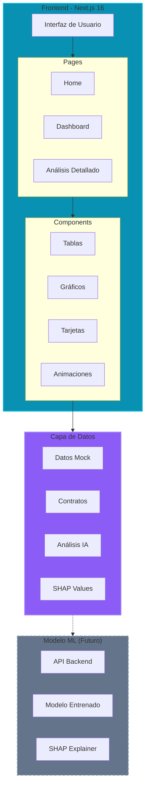
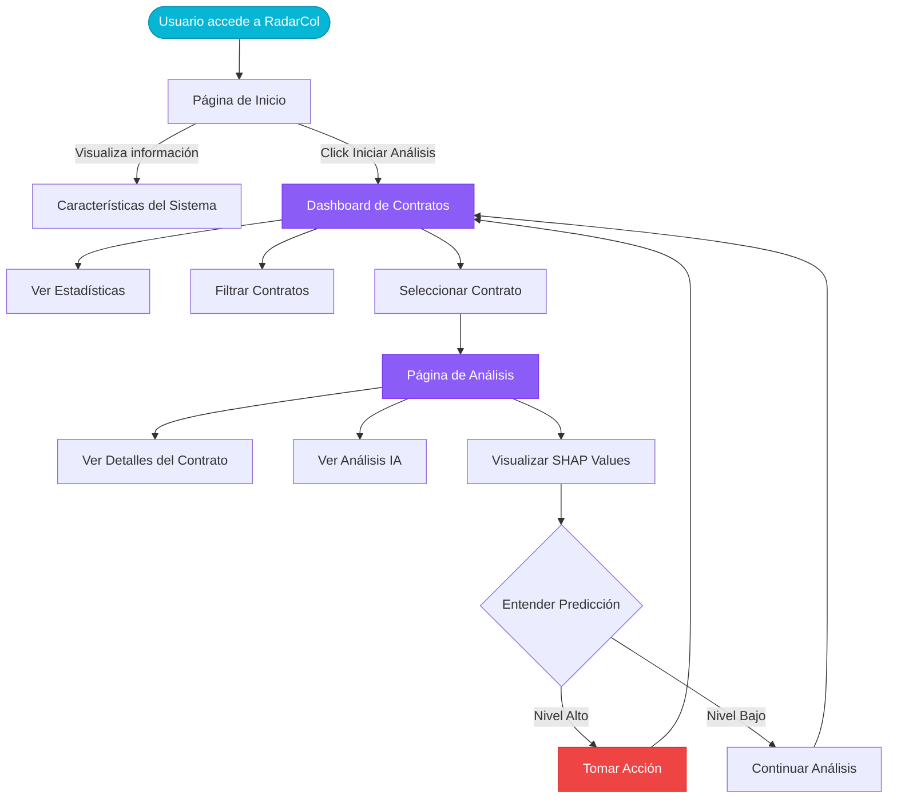

# RadarCol

> Sistema Inteligente de Detección de Anomalías en Contratos Públicos Colombianos

[](https://nextjs.org/)
[](https://www.typescriptlang.org/)
[](https://tailwindcss.com/)
[](LICENSE)

## Descripción

**RadarCol** es una plataforma web inteligente desarrollada como Trabajo Fin de Máster que utiliza técnicas de Machine Learning y explicabilidad (SHAP values) para detectar y analizar anomalías en contratos de contratación pública en Colombia. El sistema permite identificar patrones sospechosos, calcular niveles de riesgo y proporcionar explicaciones interpretables sobre las decisiones del modelo de inteligencia artificial.

## Características Principales

- **Análisis Inteligente**: Detección automática de anomalías mediante algoritmos de Machine Learning
- **Explicabilidad**: Visualización de SHAP values para entender las predicciones del modelo
- **Dashboard Interactivo**: Vista consolidada de contratos con filtros y estadísticas en tiempo real
- **Análisis Detallado**: Página dedicada para cada contrato con métricas y gráficos
- **Sistema de Riesgo**: Clasificación por niveles (Alto, Medio, Bajo) con código de colores
- **Visualización de Datos**: Gráficos interactivos con Recharts para análisis visual
- **Diseño Cyberpunk**: Interfaz moderna con animaciones de partículas y efectos visuales
- **Responsive Design**: Optimizado para dispositivos móviles y escritorio

## Arquitectura del Sistema



## Stack Tecnológico

### Frontend Framework
- **Next.js 16.1.0**: Framework React con App Router y Turbopack
- **React 19.2.3**: Biblioteca UI con Server Components
- **TypeScript 5**: Tipado estático para mayor robustez

### Estilos y Animaciones
- **Tailwind CSS v4**: Sistema de diseño con @theme inline
- **Framer Motion 12**: Animaciones fluidas y transiciones
- **@tsparticles**: Efectos de partículas para el fondo cyberpunk
- **Lucide React**: Biblioteca de iconos profesionales

### Visualización de Datos
- **Recharts 3.6.0**: Gráficos interactivos y responsivos
- **Tremor React**: Componentes UI para dashboards
- **date-fns**: Manejo y formato de fechas

### Herramientas de Desarrollo
- **ESLint**: Linting y calidad de código
- **PostCSS**: Procesamiento de CSS
- **Git**: Control de versiones

## Flujo de Usuario



## Estructura del Proyecto

```
radarcol/
├── app/                          # App Router de Next.js 16
│   ├── analysis/[id]/           # Rutas dinámicas para análisis
│   │   └── page.tsx             # Página de análisis detallado
│   ├── dashboard/               # Dashboard principal
│   │   └── page.tsx             # Tabla de contratos
│   ├── globals.css              # Estilos globales con Tailwind
│   ├── layout.tsx               # Layout raíz
│   └── page.tsx                 # Página de inicio (Home)
│
├── components/                   # Componentes reutilizables
│   ├── analysis/                # Componentes de análisis
│   │   ├── AIExplanation.tsx   # Explicación del modelo IA
│   │   ├── ContractDetails.tsx # Detalles del contrato
│   │   └── ShapChart.tsx       # Gráfico de SHAP values
│   ├── dashboard/               # Componentes del dashboard
│   │   └── ContractTable.tsx   # Tabla responsive de contratos
│   ├── home/                    # Componentes del home
│   │   └── HeroSection.tsx     # Sección hero con animaciones
│   └── ui/                      # Componentes UI reutilizables
│       ├── Badge.tsx            # Badge de estado
│       ├── GlowButton.tsx       # Botón con efecto neón
│       ├── MainLayout.tsx       # Layout principal
│       ├── Navbar.tsx           # Barra de navegación
│       └── ParticlesBackground.tsx # Animación de partículas
│
├── data/                        # Datos mock para desarrollo
│   ├── mockAnalysis.ts         # Análisis y SHAP values
│   └── mockContracts.ts        # Contratos de ejemplo
│
├── lib/                         # Utilidades y helpers
│   └── utils.ts                # Funciones auxiliares
│
├── types/                       # Definiciones de TypeScript
│   ├── analysis.ts             # Tipos para análisis
│   └── contract.ts             # Tipos para contratos
│
└── public/                      # Archivos estáticos
```

## Instalación

### Prerequisitos

- Node.js 20.x o superior
- npm o yarn
- Git

### Pasos de Instalación

1. **Clonar el repositorio**

```bash
git clone https://github.com/JairPrada/RadarColTfm.git
cd RadarColTfm
```

2. **Instalar dependencias**

```bash
npm install
# o
yarn install
```

3. **Ejecutar en modo desarrollo**

```bash
npm run dev
# o
yarn dev
```

4. **Abrir en el navegador**

Visita [http://localhost:3000](http://localhost:3000) para ver la aplicación.

## Uso

### Dashboard

Accede al dashboard principal para:
- Visualizar estadísticas globales de contratos
- Filtrar por nivel de riesgo
- Ver probabilidad de anomalía de cada contrato
- Navegar a análisis detallados

### Análisis Detallado

Haz click en cualquier contrato para:
- Ver información completa del contrato
- Analizar la explicación del modelo IA
- Visualizar SHAP values en gráfico interactivo
- Entender qué variables influyen en la predicción

## Patrones de Diseño Implementados

El proyecto sigue principios de Clean Code y aplica diversos patrones de diseño:

- **Container/Presentation Pattern**: Separación entre lógica y presentación
- **Strategy Pattern**: Configuraciones intercambiables (partículas, botones)
- **Adapter Pattern**: Transformación de datos para visualización
- **Composite Pattern**: Composición de componentes modulares
- **Variants Pattern**: Estados de animación con Framer Motion

## Contexto Académico

### Trabajo Fin de Máster

Este proyecto constituye el Trabajo Fin de Máster (TFM) enfocado en:

- **Objetivo**: Desarrollar un sistema inteligente para detectar anomalías en contratación pública
- **Alcance**: Frontend interactivo con visualizaciones avanzadas y explicabilidad
- **Tecnologías**: Next.js 16, TypeScript, Machine Learning (conceptual), SHAP
- **Contribución**: Mejorar la transparencia y reducir la corrupción en contratos públicos

### Características Académicas

- Documentación exhaustiva con JSDoc
- Código limpio siguiendo principios SOLID
- Arquitectura escalable y mantenible
- Explicaciones educativas en comentarios
- Patrones de diseño profesionales

## Desarrollo

### Scripts Disponibles

```bash
npm run dev      # Inicia servidor de desarrollo
npm run build    # Construye para producción
npm run start    # Inicia servidor de producción
npm run lint     # Ejecuta ESLint
```

### Convenciones de Código

- TypeScript estricto para todos los archivos
- Componentes funcionales con hooks de React
- Documentación JSDoc en componentes principales
- Nombres descriptivos en español para variables de dominio
- Commits semánticos (feat, fix, refactor, docs)

## Roadmap

- [ ] Integración con API backend real
- [ ] Modelo de ML entrenado con datos reales
- [ ] Sistema de autenticación
- [ ] Dashboard administrativo
- [ ] Exportación de reportes en PDF
- [ ] Filtros avanzados y búsqueda
- [ ] Gráficos adicionales de análisis
- [ ] Tests unitarios y de integración
- [ ] CI/CD pipeline
- [ ] Despliegue en producción

## Contribuciones

Este es un proyecto académico. Las contribuciones, sugerencias y feedback son bienvenidos:

1. Fork el proyecto
2. Crea una rama para tu feature (`git checkout -b feature/AmazingFeature`)
3. Commit tus cambios (`git commit -m 'feat: Add AmazingFeature'`)
4. Push a la rama (`git push origin feature/AmazingFeature`)
5. Abre un Pull Request

## Licencia

Este proyecto está bajo la Licencia MIT. Ver el archivo [LICENSE](LICENSE) para más detalles.

## Autor

**Jair Andrés Prada**
- GitHub: [@JairPrada](https://github.com/JairPrada)
- Proyecto: Trabajo Fin de Máster
- Universidad: [Nombre de la Universidad]

## Agradecimientos

- Next.js team por el excelente framework
- Comunidad de código abierto
- Profesores y tutores del máster
- Datos de contratación pública de Colombia

---

**RadarCol** - Análisis Inteligente de Contratos Públicos
